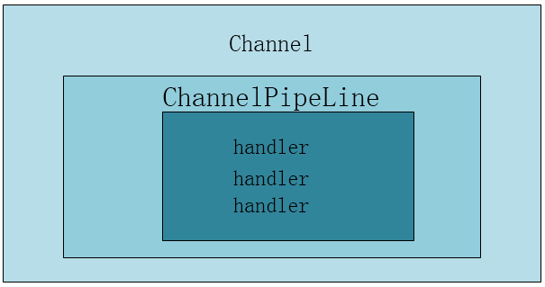

# 概念
ChannelPipeline 是 ChannelHandler 的容器，它负责 ChannelHandler 的管理和事件拦截与调度。
Netty 的 ChannelHandler 机制类似于 Servlet 和 Filter 过滤器，这类拦截器实际上是职责链的
一种变形，主要是为了方便事件的拦截和用户业务逻辑的定制。

Netty 的 channel 运行机制和 Filter 过滤器机制一样，它将 Channel 的数据管道抽象为 ChannelPipeline。
消息在 ChannelPipeline 中流动和传递。ChannelPipeline 持有 I/O 事件拦截器 ChannelHandler
的链表，由ChannelHandler 对I/0 事件进行拦截和处理，可以方便地通过新增和删除ChannelHandler 来实现
不同的业务逻辑定制，不需要对已有的ChannelHandler进行修改，能够实现对修改封闭和对扩展的支持。

通过一张图我们来看一下他们之间的关系：



一个Channel中包含一个ChannelPipeline，用来处理Channel中的事件，一个ChannelPipeline中可以
包含很多个handler，还可以使用各种handler来处理通信信息。

同时我们也注意到在 handler 中继承了ChannelInboundHandlerAdapter类并实现了他的一些方法，
比如：channelRead，channelActive，channelInactive等等，我们看到这些方法中都有一个参数：
ChannelHandlerContext ctx。这个ChannelHandlerContext就是handler的上下文对象，有了这个
ChannelHandlerContext你就获得了一切，你可以获得通道，获得事件的控制权。

事实上，用户不需要自己创建pipeline，因为使用ServerBootstrap 或者Bootstrap 启动 
服务端或者客户端时， Netty 会为每个Channel 连接创建一个独立的pipeline。
```java
ChannelPipeline pipeline = socketChannel.pipeline();

pipeline.addLast("framer", new DelimiterBasedFrameDecoder(8192,Delimiters.lineDelimiter()));
pipeline.addLast("decoder", new StringDecoder());
pipeline.addLast("encoder", new StringEncoder());

// 客户端的逻辑
pipeline.addLast("handler", new HelloWorldClientHandler());
```
ChannelPipeline 是线程安全的， 这意味着N个业务线程可以并发地操作ChannelPipeline 
而不存在多线程并发问题。但是，ChannelHandler却不是线程安全的，这意味着尽管 
ChannelPipeline 是线程去全的， 但是仍然需要自己保证ChannelHandler的线程安全。

Netty 中的事件分为inbound 事件和outbound 事件。inbound 事件通常由I/O线程触发，
例如TCP 链路建立事件、链路关闭事件、读事件、异常通知事件等。Outbound 事件通常是I/O 
用户主动发起的网络I/O 操作，例如用户发起的连接操作、绑定操作、消息发送等操作。

我们常用的inbound事件有：

- ChannelHandlerContext fireChannelRegistered() //channel注册事件
- ChannelHandlerContext fireChannelActive() //channel激活事件
- ChannelHandlerContext fireExceptionCaught(Throwable var1) //channel异常处理事件
- ChannelHandlerContext fireUserEventTriggered(Object var1) //用户自定义事件
- ChannelHandlerContext fireChannelRead(Object var1) //读事件
